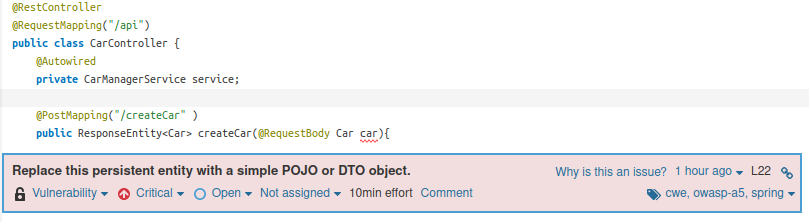

# Lab 6 Static Code analysis (with SonarQube)

## Exercise 6.2

Prepare a local instance of SonarQube (using the Docker image):
```
$ docker run -d --name sonarqube -e SONAR_ES_BOOTSTRAP_CHECKS_DISABLE=true -p 9000:9000 sonarqube:latest
```

Once your instance is up and running, Log in to http://localhost:9000 using System Administrator credentials:
* login: admin
* password: admin

Update password: 12345

### **Create project:**
Project key, display name: lab6_2

Name Token: token1

Gnerate:
* token1: 819438c51094e6232c871340f06e66c273b94515

```
 mvn clean verify sonar:sonar   -Dsonar.projectKey=lab6_2   -Dsonar.host.url=http://localhost:9000   -Dsonar.login=819438c51094e6232c871340f06e66c273b94515
 ```

### Alinea f

O meu projeto passou no defined quality gate.

### Alinea g

| Issue                 | Problem description   | How to solve |
| --------------------- |            ---------- | -----        |
|      | FIXME tags are commonly used to mark places where a bug is suspected, but which the developer wants to dealwith later (MITRE, CWE-546 - Suspicious Comment). Sometimes the developer will not have the time or will simply forget to get back to that tag. This rule is meant to track those tags and to ensure that they do not go unnoticed.                     |  Retirar o comentario, visto que o projeto já está feito, e nao temos que fazer aquilo que o FIXME indica.            |
|      | The imports part of a file should be handled by the Integrated Development Environment (IDE), not manually by the developer. Unused and useless imports should not occur if that is the case. Leaving them in reduces the code’s readability, since their presence can be confusing. (Code smell, minor)                       |  Retirar o import pois estamos a fazer este import desnecessariamente, visto que as classes do mesmo package estao implicitamente imported.               |
|     | JUnit5 is more tolerant regarding the visibilities of Test classes than JUnit4, which required everything to be public. In this context, JUnit5 test classes can have any visibility but private, however, it is recommended to use the default package visibility, which improves readability of code. (Bug handled by the rule S5810 .)                       | Alterar a visibilidade de public para private, tanto na classe como na funcao testGetTotalValue().              |


## Exercise 6.3

Prepare a local instance of SonarQube (using the Docker image):
* Usei o docker container criado na alinea anterior.

Once your instance is up and running, Log in to http://localhost:9000 using System Administrator credentials:
* login: admin
* password: 12345

### **Create project:**
Project key, display name: lab6_3

Use existing token: 819438c51094e6232c871340f06e66c273b94515

Corri o docker:
```
docker run --name mysql5tqs -e MYSQL_ROOT_PASSWORD=password -e MYSQL_DATABASE=tqsdemo -e MYSQL_USER=demo -e MYSQL_PASSWORD=demo -p 33060:3306 -d mysql/mysql-server:5.7
```

```
mvn clean verify sonar:sonar \
  -Dsonar.projectKey=lab6_3 \
  -Dsonar.host.url=http://localhost:9000 \
  -Dsonar.login=819438c51094e6232c871340f06e66c273b94515
```

### Notes

Technical debt é uma medida de comprometimento na qualidade do código feito para compensar prazos de entrega rápidos.Ás vezes, é mais importante desvalorizar um pouco a qualidade de código do projeto e fazer entregas do mesmo mais rápido, por isso, é importante saber esta medida. Resumindo, technical debt é o resultado de priorizar a entrega rápida sobre o código perfeito.

Technical debt found on project cars: 41 minutos.


Analysis of problems reported by SonarQuebe:

| Issue                    | Problem description   | How to solve |
| --------------------- |            ---------- | -----        |
|  | On one side, Spring MVC automatically bind request parameters to beans declared as arguments of methods annotated with @RequestMapping. Because of this automatic binding feature, it’s possible to feed some unexpected fields on the arguments of the @RequestMapping annotated methods. On the other end, persistent objects (@Entity or @Document) are linked to the underlying database and updated automatically by a persistence framework, such as Hibernate, JPA or Spring Data MongoDB. These two facts combined together can lead to malicious attack: if a persistent object is used as an argument of a method annotated with @RequestMapping, it’s possible from a specially crafted user input, to change the content of unexpected fields into the database. For this reason, using @Entity or @Document objects as arguments of methods annotated with @RequestMapping should be avoided. In addition to @RequestMapping, this rule also considers the annotations introduced in Spring Framework 4.3: @GetMapping, @PostMapping, @PutMapping, @DeleteMapping, @PatchMapping. (CWE-915: Improperly Controlled Modification of Dynamically-Determined Object Attributes) | Criar outro model (CarRequestModel.java) sem anotacoes, sem @Entity ou @Document, com atributo maker e model. No @PostMapping do CarController fazer @RequestBody deste novo model, e processar este dado de modo que se salve um Car.        |
|     | When verifying that code raises a runtime exception, a good practice is to avoid having multiple method calls inside the tested code, to be explicit about which method call is expected to raise the exception. It increases the clarity of the test, and avoid incorrect testing when another method is actually raising the exception. | Colocar dentro do assertThrows a chamada da funcao que irá retornar a exececao. Neste caso nao resolvi assim, porque decici mudar a funcao getCarDetails() no ficheiro CarManagerService.         |
|  | A test case without assertions ensures only that no exceptions are thrown. Beyond basic runnability, it ensures nothing about the behavior of the code under test. Furthermore, as new or custom assertion frameworks may be used, the rule can be parametrized to define specific methods that will also be considered as assertions. No issue will be raised when such methods are found in test cases. The parameter value should have the following format <FullyQualifiedClassName>#<MethodName>, where MethodName can end with the wildcard character. For constructors, the pattern should be <FullyQualifiedClassName>#<init>. Example: com.company.CompareToTester#compare*,com.company.CustomAssert#customAssertMethod,com.company.CheckVerifier#<init>. | Adicionar asserts. |

Depois de analisar os problemas reportados corrigi-os todos, o projeto com os problemas corrigidos encontram-se na pasta:
* [/lab6/lab6_3/cars](https://github.com/eva-pomposo/tqs_98513/tree/main/lab6/lab6_3/cars)

Já o projeto com os problemas por resolver encontram-se na pasta:
* [/lab3/lab3_2/cars](https://github.com/eva-pomposo/tqs_98513/tree/main/lab3/lab3_2/cars)

Analysis of problems reported by SonarQube after correct the problems:


Depois de adicionar o Jacoco plugin fui analisar o code coverage reports.
Verifiquei que 8 linhas estavam not covered, 5 no model Car, 2 no CarsApplication e 1 no CarManagerService.Além disso, tambem vi que 30 condicoes no model Car estavam uncovered.
O ficheiro Car é aquele que tem mais percentagem de uncovered, visto que, aparenta várias condicoes e linhas de código que nao sao necessarios testes, como getters e setters. 


