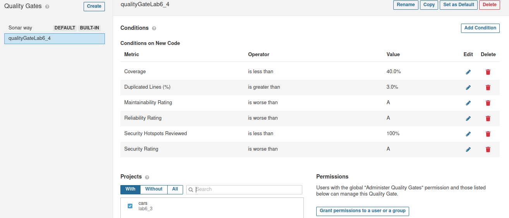
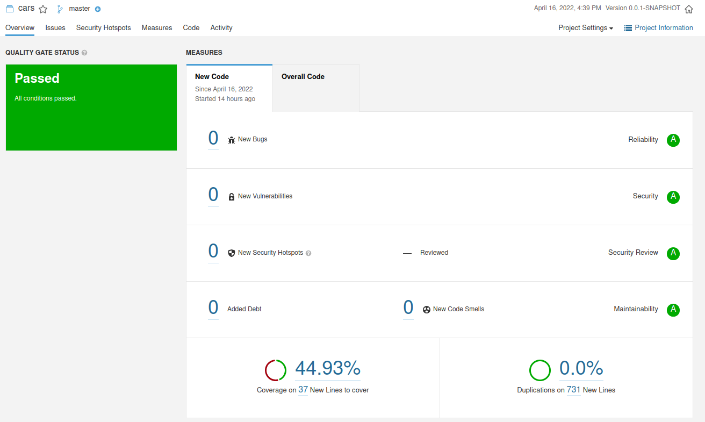
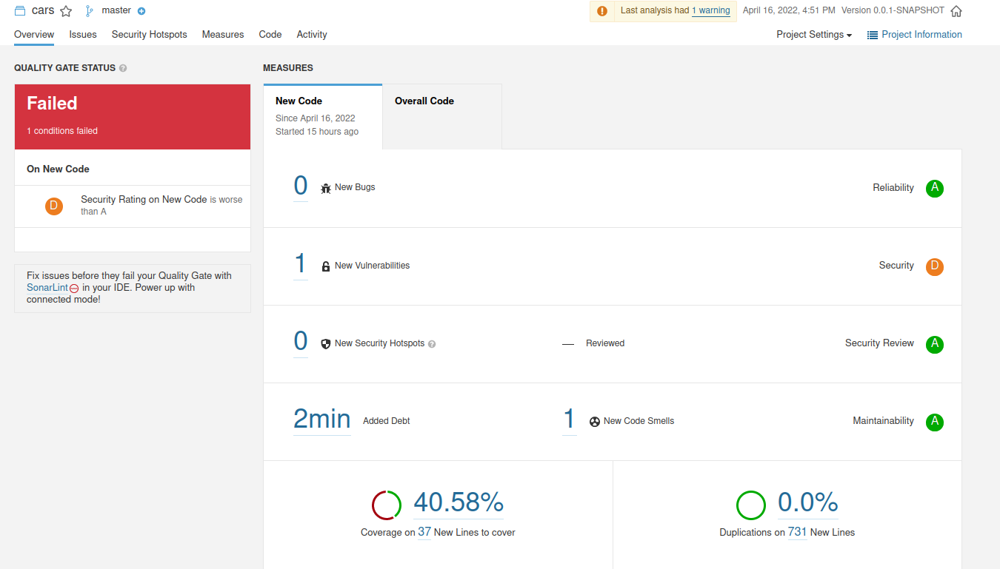

# Exercise 6.4

Para este exercicio decidi usar o projeto do exercicio anterior.

## Alinea a

No exercicio 6.3 depois de corrigir todos os problemas verifiquei que o projeto falhou no quality gate. O quality gate usado foi o default.

A percentagem de coverage no novo código foi de 44.93%, menos que 80%, nao respeitando assim as condicoes do quality gate usado, que exige coverage code no novo código superior a 80%.

Perante isto, e tendo em conta que as novas condicoes e linhas de codigo adicionadas nao sao precisos de testes, pois sao getters, setters, etc, decidi defenir um quality gate para este projeto.
O quality gate que defeni é igual ao default menos a condicao do coverage on new code,essa condicao mudei para que o coverage no novo codigo seja menos que 40%, isto por causa das razoes que disse em cima.

Depois de defenir este quality gate no projeto cars, e correr de novo, verifiquei que o quality gate desta vez já passou. 

## Alinea b

Adicionei a vulnerabilidade ["Persistent entities should not be used as arguments of "@RequestMapping" methods"](https://jira.sonarsource.com/browse/RSPEC-4684) ao projeto, e depois corri e verifiquei que nao passou no quality gate que defeni.

O projeto nao passou no quality gate porque apresenta uma vulnerabilidade com o Security Rating no novo código classificado como D, o que é pior que A, e no quality gate usado temos a condicao que o Security Rating no novo código nao pode ser pior que A. 
